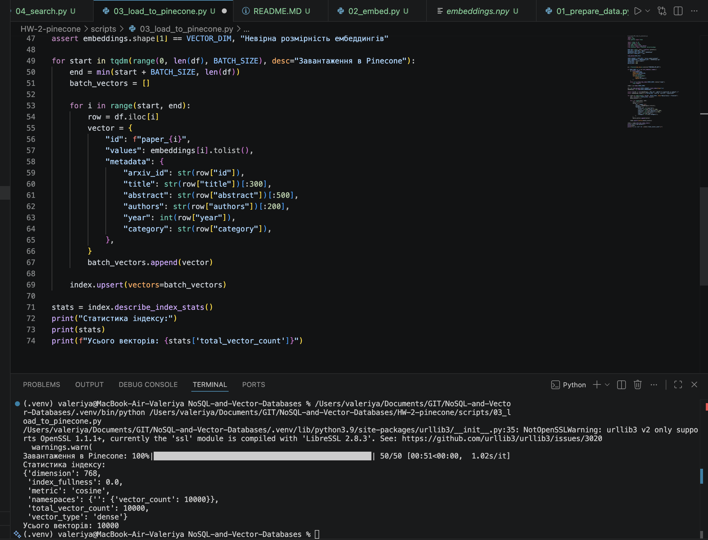
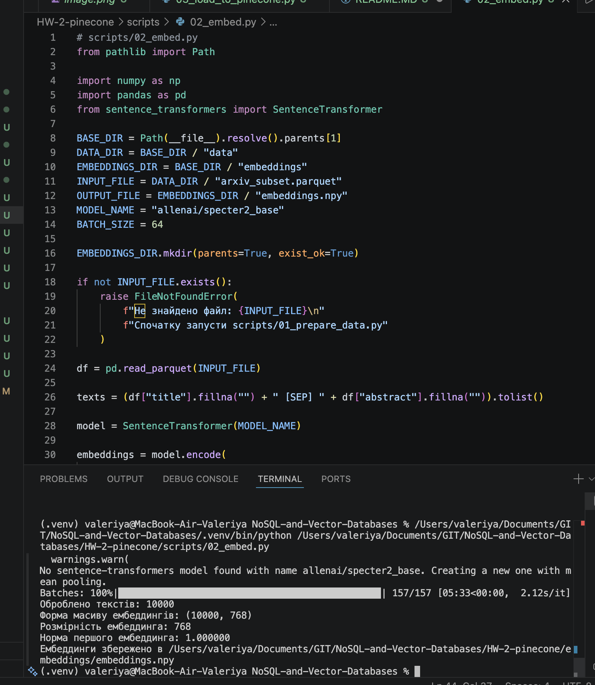

# Завдання 2: Семантичний пошук за науковими статтями (arXiv + Pinecone)

## Мета
Побудувати повний пайплайн пошуку за науковими текстами:
1. Підготовка даних з arXiv JSONL у parquet.
2. Генерація ембеддингів моделлю `allenai/specter2_base`.
3. Завантаження у Pinecone з метаданими.
4. Семантичний пошук, фільтри, порівняння метрик.
5. Порівняння chunking-стратегій.
6. Гібридний пошук BM25 + vector через RRF.

В роботі використано підмножину на 10000 статей.

---

## Ілюстрації запуску




---

## Структура проєкту

```text
HW-2-pinecone/
├── .env
├── README.MD
├── requirements.txt
├── task.txt
├── data/
│   └── arxiv_subset.parquet
├── embeddings/
│   └── embeddings.npy
├── scripts/
│   ├── 01_prepare_data.py
│   ├── 02_embed.py
│   ├── 03_load_to_pinecone.py
│   ├── 04_search.py
│   ├── 05_chunking.py
│   └── 06_hybrid_search.py
├── image.png
└── image-1.png
```

---

## Оточення

### Pinecone
У `.env`:

```env
PINECONE_API_KEY=your-api-key
```

### Залежності
`requirements.txt`:

```txt
pinecone-client==4.1.0
sentence-transformers==3.0.1
rank-bm25==0.2.2
kaggle==1.6.14
pandas==3.0.3
numpy==2.4.6
tqdm==4.66.4
pyarrow==23.0.1
python-dotenv==1.0.1
```

Встановлення:

```bash
pip install -r requirements.txt
```

### .gitignore
Додано:
- `.env`
- `HW-2-pinecone/data/`
- `HW-2-pinecone/embeddings/`

щоб не комітити ключі та великі файли.

---

## Порядок запуску

```bash
python scripts/01_prepare_data.py
python scripts/02_embed.py
python scripts/03_load_to_pinecone.py
python scripts/04_search.py
python scripts/05_chunking.py
python scripts/06_hybrid_search.py
```

---

## Частина 1. Підготовка даних і вибір інструментів

### 1.1 Підготовка датасету
JSONL перетворено у parquet (`data/arxiv_subset.parquet`), збережено поля:
- `id`, `title`, `abstract`, `authors`, `year`, `category`.

### Лог `01_prepare_data.py` (фрагмент)

```text
Читаємо датасет: 10000it [00:00, 103958.88it/s]

Завантажено статей: 10000

Розподіл за категоріями (топ-10):
astro-ph, hep-th, hep-ph, quant-ph, ...

Розподіл за роками:
2007    10000

Збережено в .../HW-2-pinecone/data/arxiv_subset.parquet
```

### 1.2 Вибір інструментів

#### 1) Pinecone vs Qdrant vs Chroma
- Pinecone: fully-managed SaaS, мінімум DevOps, швидкий старт для продакшену, але vendor lock-in і тарифні обмеження.
- Qdrant: open-source/self-hosted або cloud, гнучкий контроль інфраструктури, зручно для кастомних сценаріїв і локального продакшену.
- Chroma: найпростіший локальний старт для прототипів/RAG-демо, але менше продакшен-фіч у порівнянні з Pinecone/Qdrant.

Коли що обрати:
- Pinecone: коли потрібна керована хмара, швидкий запуск і надійність без підтримки інфри.
- Qdrant: коли потрібен контроль, власний хостинг, чітка керованість вартістю.
- Chroma: коли задача невелика, локальна, і головне швидко перевірити ідею.

#### 2) Чому `specter2_base`, а не `all-MiniLM-L6-v2`
`specter2_base` спеціалізована на наукових документах (paper-level scientific embeddings), тоді як `all-MiniLM-L6-v2` універсальна sentence-модель. Для арxiv-корпусу доменна модель краще вловлює наукову семантику, термінологію та стиль.

#### 3) Рекомендована метрика в картці моделі
Для нормалізованих ембеддингів рекомендована cosine similarity (еквівалентна dot product після нормалізації). Це важливо, бо метрика індексу Pinecone має узгоджуватись із тренувальною логікою ембеддингів. Якщо метрика неузгоджена, ранжування погіршується.

### 1.3 Теорія про нормалізацію
Для одиничних векторів $u, v$:

$$
\cos(u,v)=u \cdot v
$$

Тобто cosine та dot дають однакове ранжування.

---

## Частина 2. Ембеддинги і завантаження в Pinecone

### Лог `02_embed.py`

```text
Batches: 100%|...| 157/157
Оброблено текстів: 10000
Форма масиву ембеддингів: (10000, 768)
Розмірність ембеддинга: 768
Норма першого ембеддинга: 1.000000
Ембеддинги збережено в .../HW-2-pinecone/embeddings/embeddings.npy
```

### Лог `03_load_to_pinecone.py`

```text
Завантаження в Pinecone: 100%|...| 50/50
Статистика індексу:
{'dimension': 768,
 'metric': 'cosine',
 'namespaces': {'': {'vector_count': 10000}},
 'total_vector_count': 10000,
 'vector_type': 'dense'}
Усього векторів: 10000
```

Чому `abstract` обрізається в metadata: щоб не перевищувати обмеження Pinecone на розмір metadata на вектор.

---

## Частина 3. Пошук і порівняння метрик

### Лог `04_search.py` (фрагмент)

```text
=== Семантичний пошук: teaching machines to recognize objects in pictures ===
1. Capturing knots in polymers ... score=0.8288
2. Symbolic sensors ... score=0.8263
...

=== Фільтр A: RL, останні 5 років, cs.LG ===
(порожньо)

=== Фільтр B: RL, до 2015 року ===
1. Introduction to Phase Transitions in Random Optimization Problems ... score=0.8025
...

=== Локальна метрика: cosine ===
...
=== Локальна метрика: dot ===
...
=== Локальна метрика: l2 ===
...
```

### Відповіді на теорію

1) Чи збігаються top-5 для cosine і dot?
- Так, практично збігаються. Після нормалізації ембеддингів cosine і dot еквівалентні.

2) Чи відрізняється L2?
- У моєму запуску топи дуже близькі до cosine/dot. Для одиничних векторів L2 монотонно пов'язана з cosine:

$$
\|u-v\|^2 = 2 - 2(u\cdot v)
$$

Тобто чим більший dot/cosine, тим менша L2-дистанція.

3) Що було б без нормалізації?
- Dot починає залежати від довжини вектора, а не тільки напряму. Це може штучно піднімати документи з великими нормами векторів і псувати релевантність.

---

## Частина 4. Chunking

### Лог `05_chunking.py` (фрагмент)

```text
Fixed chunks -> Pinecone: 100%|...| 1/1
Semantic chunks -> Pinecone: 100%|...| 1/1

######## QUERY: graph neural networks for molecules ########
--- Fixed-size ---
1. Geochemistry of U and Th ... score=0.7530
...
--- Semantic ---
1. Geochemistry of U and Th ... score=0.7580
...
```

### Відповіді на теорію

1) Яка стратегія осмисленіша?
- Semantic chunking зазвичай осмисленіший, бо зберігає межі речень і менше "ламає" контекст.

2) Чи є розрізані речення?
- У fixed-size так, і це знижує якість ембеддинга чанка (втрата локального змісту).

3) Вплив overlap
- Більший overlap покращує покриття переходів між чанками, але збільшує кількість чанків, обсяг ембеддингів та витрати на індексацію.

---

## Частина 5. Гібридний пошук (BM25 + Vector + RRF)

### Лог `06_hybrid_search.py` (фрагмент)

```text
############ QUERY: BERT fine-tuning ############
=== BM25 ===
1. The NMSSM Solution to the Fine-Tuning Problem ... score=11.5017
=== Vector ===
1. Abstract Convexity and Cone-Vexing Abstractions ... score=0.8193
=== Hybrid RRF ===
1. The NMSSM Solution to the Fine-Tuning Problem ... rrf=0.016393

############ QUERY: Yann LeCun convolutional networks ############
...

############ QUERY: making computers understand human emotions from text ############
...
```

### Порівняльна таблиця (3 запити x 3 методи)

| Запит | BM25 (top-1) | Vector (top-1) | Hybrid RRF (top-1) |
|---|---|---|---|
| BERT fine-tuning | The NMSSM Solution to the Fine-Tuning Problem... | Abstract Convexity and Cone-Vexing Abstractions | The NMSSM Solution to the Fine-Tuning Problem... |
| Yann LeCun convolutional networks | On Punctured Pragmatic Space-Time Codes... | The Netsukuku network topology | On Punctured Pragmatic Space-Time Codes... |
| making computers understand human emotions from text | An Automated Evaluation Metric for Chinese Text Entry | Opinion Dynamics and Sociophysics | On the Development of Text Input Method - Lessons Learned |

### Відповіді на теорію

1) Який метод кращий?
- Для точних термінів/імен BM25 часто сильніший.
- Для перефразувань векторний пошук зазвичай сильніший.
- Гібридний дає найстабільнішу якість, бо поєднує обидва сигнали.

2) Чи є у hybrid документи, яких нема в top-5 окремих?
- Так, можливе підняття документа, який не перший у жодному методі, але має добрі ранги в обох. Це і є ефект RRF.

3) Вплив параметра `k` у RRF
- `k=1`: сильний акцент на перших позиціях (агресивне ранжування).
- `k=60`: згладжений вклад рангу, стабільніше об'єднання.

---

## Частина 6. Аналіз і висновки

### 1) Семантичний пошук vs BM25
BM25 виграє, коли запит містить точні ключові слова, абревіатури, імена (наприклад `BERT fine-tuning`, `Yann LeCun`). Семантичний пошук виграє при перефразуваннях і непрямих формулюваннях, коли потрібна близькість за змістом, а не за токенами. На практиці доцільно запускати гібрид, бо він покриває обидва режими.

### 2) Вплив розміру чанка
- Занадто маленький чанк (10-15 слів): слабкий контекст, багато шуму.
- Занадто великий (500+): змішується кілька тем, вектор "усереднюється".
Оптимум залежить від домену, але для abstract-подібних текстів 150-250 слів з overlap зазвичай практичний компроміс.

### 3) Невідповідна метрика (L2 vs cosine)
Для нормалізованих векторів:

$$
\|u-v\|^2 = \|u\|^2 + \|v\|^2 - 2u\cdot v = 2 - 2\cos(u,v)
$$

Тобто L2 і cosine дають еквівалентний порядок (монотонний зв'язок). Якщо вектори не нормалізовані, еквівалентність порушується.

### 4) Обмеження Pinecone Starter і масштаб до 10M
Starter обмежує кількість індексів/ресурсів, тому доводиться економити namespace, batching і metadata. Для 10M статей я б:
- перейшов на прод-тір або self-hosted векторну БД,
- розбив індекси по shard/тематиці/роках,
- використав async bulk ingestion,
- зберігав повні тексти в окремому сховищі (object storage + metadata DB),
- додав би багаторівневий retrieval (coarse -> rerank).

---

## Підсумок
Всі скрипти `01`-`06` реалізовані та протестовані. Отримано робочий пайплайн: підготовка даних, ембеддинги, індексація Pinecone, семантичний пошук, chunking, і гібридний пошук через RRF. Головний практичний висновок: у реальній системі найкраще працює саме гібридний підхід, а якість суттєво залежить від узгодження моделі, метрики та стратегії chunking.
