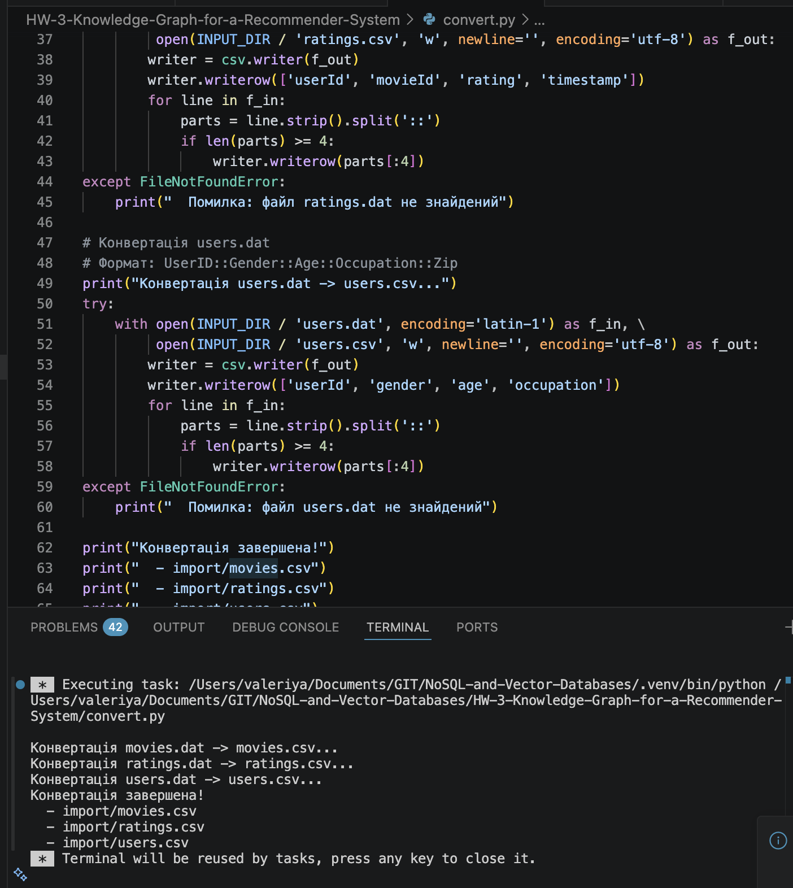
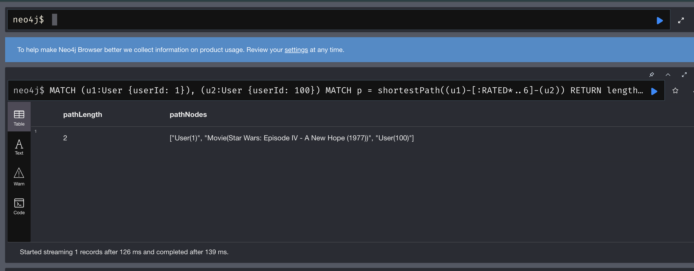
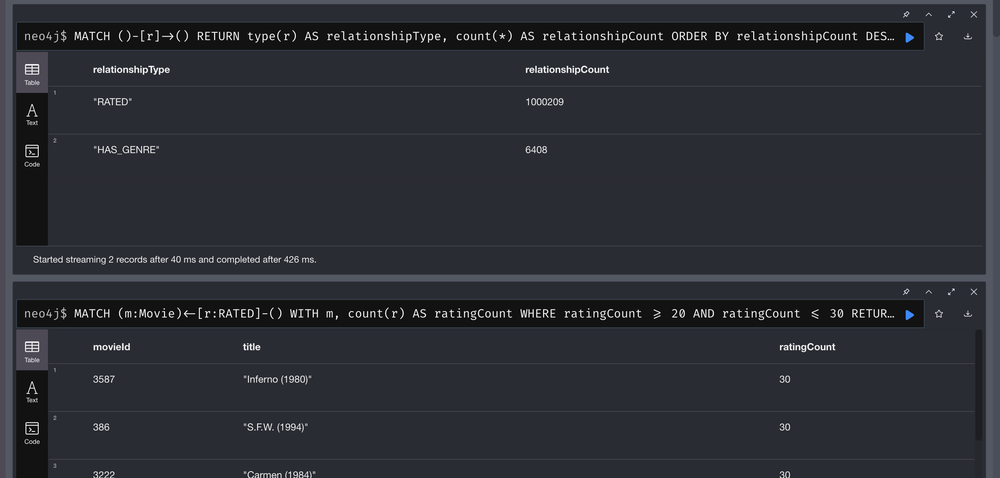
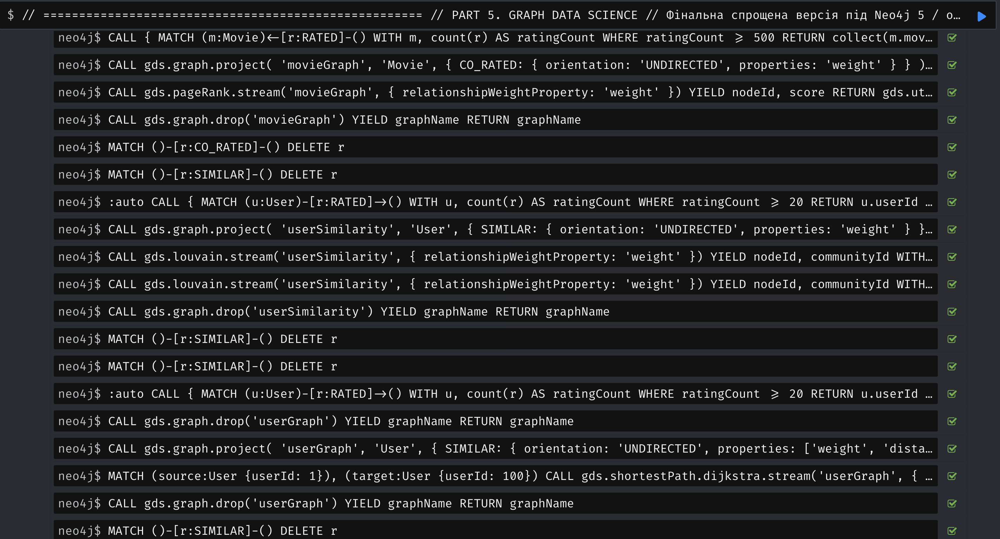
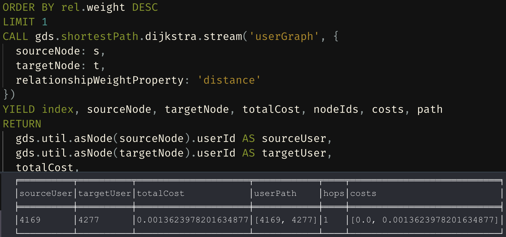

# Завдання 3. Граф знань для рекомендаційної системи (Neo4j + GDS)

## 1. Мета роботи
Побудувати повний пайплайн для аналізу MovieLens 1M у графовій БД Neo4j:
- підготувати дані (`.dat -> .csv`),
- завантажити вузли та зв'язки,
- виконати Cypher-запити різної складності,
- проаналізувати супервузли,
- запустити алгоритми GDS (PageRank, Louvain, Dijkstra),
- порівняти графовий підхід із реляційним.

---

## 2. Дані
Використано MovieLens 1M:
- `users.dat`
- `movies.dat`
- `ratings.dat`

Після конвертації отримано:
- `import/users.csv`
- `import/movies.csv`
- `import/ratings.csv`

Конвертація виконана скриптом `convert.py`.

Скріншот працездатності конвертації:



---

## 3. Запуск середовища
Локальний запуск Neo4j через Docker Compose:

```bash
docker compose up -d
```

Параметри доступу:
- Neo4j Browser: `http://localhost:7474`
- Bolt: `localhost:7687`
- логін: `neo4j`
- пароль: `password123`

Файл запуску: `docker-compose.yml`.

---

## 4. Проєктування схеми

### 4.1 Модель графа

```text
(:User {userId, gender, age, occupation})
   -[:RATED {rating, timestamp}]->
(:Movie {movieId, title})
   -[:HAS_GENRE]->
(:Genre {name})
```

### 4.2 Чому саме так
1. Вузли: `User`, `Movie`, `Genre`, тому що це самостійні сутності домену.
2. Оцінка як ребро `RATED`, а не окремий вузол `Rating`, бо оцінка є властивістю взаємодії користувач-фільм. Це простіше для рекомендаційних обходів і дешевше по кількості елементів графа.
3. `Genre` як окремий вузол (а не список у `Movie`) дає нормалізацію, зручні агрегації по жанрах і швидкі traversal-запити.

---

## 5. Частина 2: завантаження даних

Скрипт завантаження: `queries/part2_load.cypher`.

### 5.1 Індекси
Створено індекси для:
- `User(userId)`
- `Movie(movieId)`
- `Genre(name)`

### 5.2 Порядок імпорту
1. `User`
2. `Movie`
3. `Genre`
4. `HAS_GENRE`
5. `RATED` (batch через `apoc.periodic.iterate`)

### 5.3 Підсумкові обсяги
За результатом перевірочних запитів:

| Метрика | Значення |
|---|---:|
| `RATED` | 1,000,209 |
| `HAS_GENRE` | 6,408 |

(значення підтверджені скріншотом у частині 7).

---

## 6. Частина 3: Cypher-запити
Файл: `queries/part3.cypher`.

Реалізовано 6 запитів:
1. Thriller-фільми з середнім рейтингом > 4.0.
2. Користувачі, які поставили 5 зірок > 50 разів.
3. Спільно високо оцінені фільми користувачами 1 і 2.
4. Жанри зі стабільно високими оцінками.
5. Рекомендації "користувачі зі схожими смаками також дивилися".
6. Найкоротший ланцюжок між двома користувачами через `RATED`.

Приклад результату для Query 6:

| pathLength | pathNodes |
|---:|---|
| 2 | `User(1) -> Movie(Star Wars: Episode IV - A New Hope (1977)) -> User(100)` |

Скріншот Query 6:



---

## 7. Частина 4: аналіз супервузлів
Файл: `queries/part4_supernodes.cypher`.

Що перевірено:
- топ користувачів за кількістю оцінок,
- топ фільмів за кількістю оцінок,
- топ жанрів за кількістю зв'язків,
- глобальний пошук вузлів з великим degree,
- порівняння "звичайних" та популярних фільмів,
- типи зв'язків у графі.

### Висновок по супервузлах
Супервузли (популярні фільми та великі жанри) збільшують fan-out при обходах. Це може впливати на продуктивність traversal-запитів, навіть якщо стартова точка знаходиться швидко через індекс.

Скріншоти:



---

## 8. Частина 5: Graph Data Science
Файл: `queries/part5_gds.cypher`.

### 8.1 PageRank (на movie graph)
Алгоритм запущено на редукованому графі `CO_RATED`.

Топ-10 PageRank:

| Rank | movieId | Назва | Score |
|---:|---:|---|---:|
| 1 | 260 | Star Wars: Episode IV - A New Hope (1977) | 4.5823 |
| 2 | 1198 | Raiders of the Lost Ark (1981) | 4.1165 |
| 3 | 2858 | American Beauty (1999) | 4.0802 |
| 4 | 1196 | Star Wars: Episode V - The Empire Strikes Back (1980) | 3.9809 |
| 5 | 858 | Godfather, The (1972) | 3.7841 |
| 6 | 318 | Shawshank Redemption, The (1994) | 3.6888 |
| 7 | 2571 | Matrix, The (1999) | 3.6294 |
| 8 | 527 | Schindler's List (1993) | 3.5254 |
| 9 | 593 | Silence of the Lambs, The (1991) | 3.5076 |
| 10 | 608 | Fargo (1996) | 3.4234 |

### 8.2 Louvain (на user similarity graph)

| communityId | clusterSize |
|---:|---:|
| 1014 | 2003 |
| 2062 | 1596 |
| 4276 | 1550 |
| 2 | 1 |
| 5 | 1 |
| 6 | 1 |
| 4 | 1 |
| 8 | 1 |
| 9 | 1 |
| 7 | 1 |

Інтерпретація: є три великі кластери смаків і невелика кількість ізольованих користувачів.

### 8.3 Dijkstra (на user graph)

| sourceUser | targetUser | totalCost | userPath | hops | costs |
|---:|---:|---:|---|---:|---|
| 4169 | 4277 | 0.0013623978201634877 | `[4169, 4277]` | 1 | `[0.0, 0.0013623978201634877]` |

Інтерпретація: знайдено дуже сильний прямий зв'язок між двома користувачами.

Скріншоти виконання GDS:





---

## 9. Порівняння Neo4j і реляційного підходу

| Критерій | Neo4j | Реляційна БД |
|---|---|---|
| Багатокрокові traversal | Природні, короткі Cypher-запити | Складні JOIN + CTE |
| Рекомендації по зв'язках | Сильна сторона | Можливо, але важче підтримувати |
| Алгоритми графів (PR/Louvain/Shortest path) | Native GDS | Переважно через зовнішні інструменти |
| Класична звітність/табличні агрегації | Добре | Відмінно |

Висновок: для сценаріїв рекомендацій і path-based аналізу графова модель дає більш прозору та масштабовану логіку.

---

## 10. Висновки
1. Побудовано повний pipeline від raw MovieLens до аналітики GDS.
2. Схема з `RATED` як ребром показала себе ефективною для recommendation use-case.
3. PageRank виявив структурно центральні фільми, Louvain — кластери користувачів, Dijkstra — короткі шляхи подібності.
4. Neo4j краще підходить для зв'язаних даних і traversal-запитів, ніж реляційна модель із великою кількістю JOIN.

---

## 11. Файли проєкту
- `convert.py` — конвертація `.dat -> .csv`
- `queries/part2_load.cypher` — завантаження
- `queries/part3.cypher` — 6 Cypher-запитів
- `queries/part4_supernodes.cypher` — аналіз супервузлів
- `queries/part5_gds.cypher` — PageRank, Louvain, Dijkstra
- `docker-compose.yml` — запуск Neo4j локально
